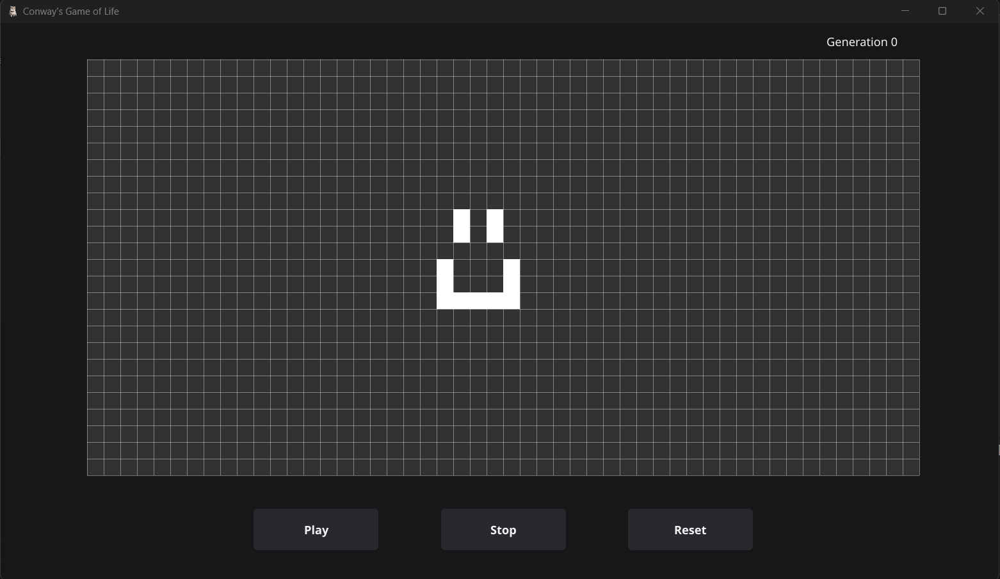
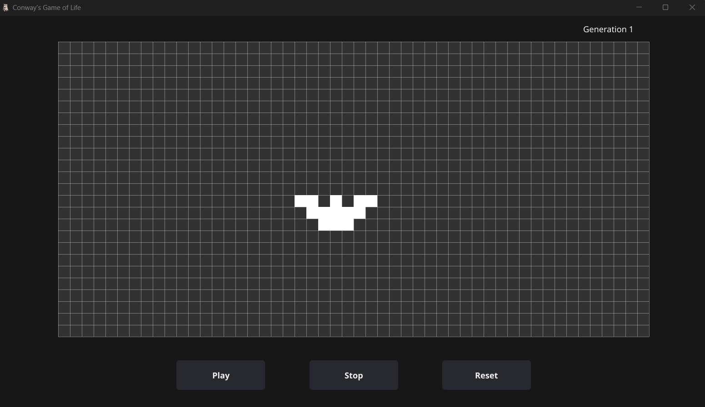
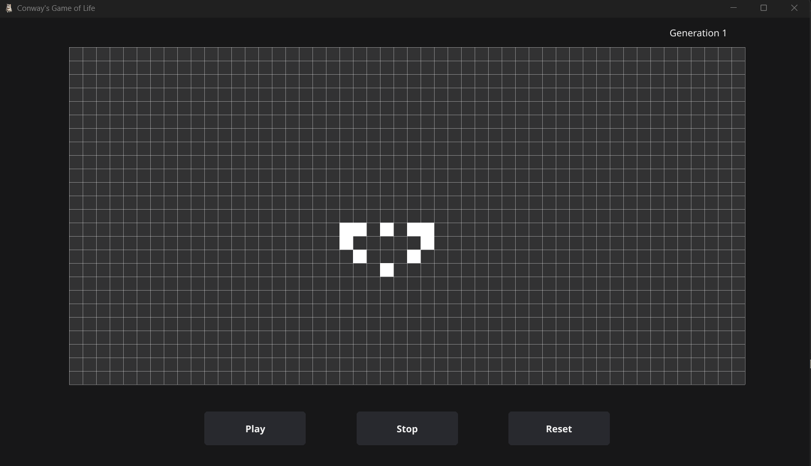
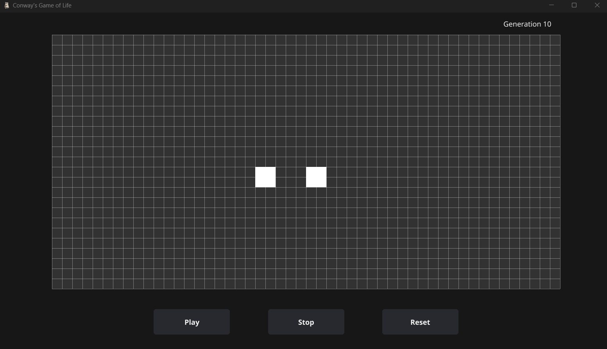

# game-of-life
*Conway's Game of Life* is a deterministic grid-based game where each cell in a grid can either be alive or dead. 

The game evolves through discrete time steps, where a cell's state in the next step is determined by its eight neighbors: a live cell with 2 or 3 neighbors stays alive, while a dead cell with exactly 3 neighbors becomes alive. 

After a few evolutions of an initial cell formation, latest generation is often completely unrecognizable from the original.

>Depending on the initial combination of live cells, the program can generate up to 20,000 generations per second without GUI updates and around 1000 generations with GUI updates.

**Example of round in Game of Life**

```diff 
+ Initial formation 
```
 


```diff 
+ 1st evolution 
```



```diff 
+ 2nd evolution  
```



```diff 
+ 3rd evolution 
```


